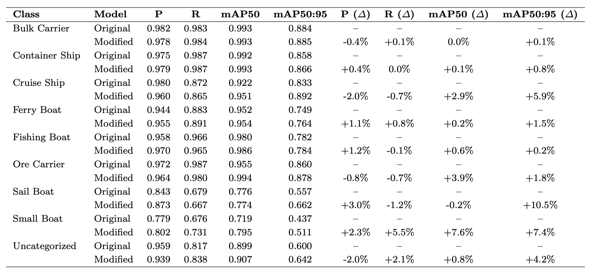

# Modified YOLOv8 Architecture with SAHI-Based Inference for Real-Time Maritime Object Detection on Edge Devices


<!-- 
This project processes stereo video captured from a ZED camera to perform real-time object detection using a YOLO model, combined with depth estimation using stereo disparity maps. The output includes bounding boxes with estimated distances and an optional video output.
-->

This project focuses on modifying the neural network architecture of YOLOv8 to add specific modules to improve performance in detecting small and varied sized objects. In addition, the SAHI mechanism is integrated to increase the number of detector objects in the inference process.

The following is a summary of the steps followed to validate the proposed architecture, as well as the models with the integration of the SAHI method in the inference:

## 1. Requirements
To run the code, you will need to install the following dependencies beforehand:

* Ultralytics =8.3.153
* Python
* Pytorch 
* Clearml 1.18.0 

### 2. Python dependencies
The best way to install python dependencies is by using a virtual environment, to do so:

```bash
$ sudo apt install virtualenv
$ virtualenv -p python3 venv
$ source venv/bin/activate
$ pip install numpy
```
To deactivate virtualenv, do by:

```bash
$ deactivate
```
## 3. Structure and format of the dataset
```
Datasense@CRAS/ │
              ├── train/ │
              │   ├── images/
              │   ├── image1.jpg
              │   ├── image2.jpg
              │   ├── .... (other image files)  
              │   └── labels/
              │   ├── label1.txt
              │   ├── label2.txt
              │   ├── .... (other label files)     
              ├── valid/ │
              │   ├── image1.jpg
              │   ├── image2.jpg
              │   ├── .... (other image files)
              │   └── labels/
              │   ├── label1.txt
              │   ├── label2.txt
              │   ├── .... (other label files) 
              ├── test/ │
              │   ├── image1.jpg
              │   ├── image2.jpg
              │   ├── .... (other image files)
              │   └── labels/
              │   ├── label1.txt
              │   ├── label2.txt
              │   ├── .... (other label files) 
              └── data.yaml 
```
### 3.1 Dataset used in this research
* Original dataset: [Datasense@CRAS](https://rdm.inesctec.pt/lv/dataset/nis-2022-001).

## 4. Add modified architecture and modules to the respective files.

Step 1: Add the file `/YoloModified/maritime.yaml` to this path `/ultralytics/cfg/models/v8/`. 

Step 2: Add this file `/YoloModified/enhanced.py` to this path: `/ultralytics/nn/modules/`.  

Step 3: Add the modified architecture modules to the "__init__.py" file at the very end, path=/ultralytics/nn/modules/__init__.py

```python
# Enhanced modules
try:
    from .enhanced import DyConv, C2f_ECA, FeatureFusion, SPPF_Enhanced, DetectEnhanced, ECAAttention
    ENHANCED_MODULES_AVAILABLE = True
except ImportError:
    ENHANCED_MODULES_AVAILABLE = False
    print("Warning: Enhanced modules not available")
```
Step 4: Modify the tasks.py file at path=/ultralytics/nn/tasks.py to import the modules added to the modified architecture. These imports are added after the existing imports in the tasks.py file.  

```python
# Enhanced modules import
try:
    from ultralytics.nn.modules.enhanced import (
        DyConv, C2f_ECA, FeatureFusion, SPPF_Enhanced, DetectEnhanced, ECAAttention
    )
    ENHANCED_AVAILABLE = True
except ImportError:
    ENHANCED_AVAILABLE = False
    print("Warning: Enhanced modules not available, falling back to standard modules")
    # Fallback imports
    from ultralytics.nn.modules.conv import Conv as DyConv
    from ultralytics.nn.modules.block import C2f as C2f_ECA
    from ultralytics.nn.modules.conv import Conv as FeatureFusion
    from ultralytics.nn.modules.block import SPPF as SPPF_Enhanced
    from ultralytics.nn.modules.head import Detect as DetectEnhanced
    from ultralytics.nn.modules.conv import Conv as ECAAttention
```
Then, in the tasks.py file you have to add other specific functions for the modules based on our proposal that are detailed in the file: `/YoloModified/Modificaciones_tasks.py`

Step 4: Before running the training using the script `/Script_train/verify_modules.py` we can check if the modules are correctly imported and working.  

## 5. Training Yolov8-Modified with custom dataset
To run or launch the training you will need:

```bash
$ python /Script_train/Yolov8_maritime.py
```

## 6. Result
### 6.1 Comparison of performance per object class between YOLOv8l baseline and our equivalent proposal

  
  
### 6.2 YOLOv8-Modified + SAHI: Comparison of object detection with YOLOv8 as standard and Yolov8 with SAHI

 

### 6.3 Comparison of the performance of YOLO models on the AGX Orin under different power settings and precision arithmetic

 


## 7. Publications

Title: "Enhanced Object Detection for Maritime Vision via Modified YOLOv8 Architecture and SAHI-Based Inference".
Journal: 

## 8. Acknowledgements
This paper has been partially funded by the EU (FEDER), the Spanish MINECO under grants PID2021-126576NB-I00 and TED2021-130123B-I00 funded by MCIN/AEI/10.13039/501100011033 and by European Union "ERDF A way of making Europe" and the NextGenerationEU/PRT. J.L.M. thanks the National Secretariat of Science, Technology and Innovation (SENACYT) of Panama for financial support during the completion of his PhD.
